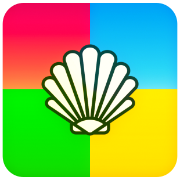

   
  <b>ImMobile</b> 
  <a href="https://github.com/basharast/ImMobile/wiki/Privacy">Privacy</a> |
  <a href="https://github.com/basharast/ImMobile/wiki">Wiki</a> |
  <a href="https://github.com/basharast/ImMobile/wiki/ImLab">Lab</a> |
  <a href="https://github.com/basharast/ImMobile/releases/latest">Releases</a> 
    

# Overview

ImMobile, a shell representing a truly universal environment designed to operate on the first Windows 8.1/10 builds and deliver a desktop-like experience, read how the project idea started [here](https://github.com/basharast/ImMobile/wiki/Story).

This project is built upon **ImGui** and **C++**, focusing on performance and flexibility.

## Legacy Ready

ImMobile supports:
- Windows 8.1 (Including 8.1 Phones)
- Windows 10, 10240+ (Include W10M/Phones) 

## What Does ImMobile Offer?

To give you a glimpse of its interface, here are some sample images:

|  |  |  |
| --- | --- | --- |
|  |  |  |
|  |  |  |

***

## UWP Storage

ImMobile provides support for legacy file stream functionality through an internal UWP resolver.

This custom resolver—comprising thousands of lines of code—enables file stream APIs to function seamlessly within user-selected folders.

It handles numerous edge cases and has been meticulously engineered to replicate the behavior of the official API as closely as possible.

## Touch Environment

ImMobile includes a touch resolver to improve the touch experience.

It currently supports **up to 2 touch points** for the main UI, allowing you to scroll and zoom in/out.

The **TouchPad** (used for gaming) has a **dynamic range of touch points** and is not limited to 2.

Touch settings allow users to customize the touch behavior for a better experience.

Additionally, extensions can handle touch points as needed.

 
Showcase (Click Here)

   
  
|  |  |
| --- | --- |
  

## Desktop-like Environment

ImMobile offers a desktop-like experience similar to Windows, featuring easy-to-use tools such as a **file browser/manager**.

These tools enhance the feeling of a **standalone environment**, reducing interruptions from pickers, popups, and notifications.

## Desktop Bridge

ImMobile Desktop Bridge extension allows you to run normal desktop apps inside ImMobile environment (with limitations)

Read more about [Desktop Bridge here](https://github.com/basharast/ImMobile/wiki/Desktop-Bridge)

## ImMobile Extensions

**Extensions** are designed to expand the capabilities of ImMobile beyond its default functionality.  
They can reduce development effort by **up to 50% or more**, and they run as part of the **ImMobile UI engine**.

Check out [ImmExtension Examples](https://github.com/basharast/ImMobile/tree/main/development/ExtensionsExamples)

Extension can be developed without limits with rich API provided by ImMobile

 
Showcase (Click Here)

   
  
|  |  |  |
| --- | --- | --- |
  

### Current Extensions

- DOSBox
- [Libretro](https://github.com/basharast/ImLibretro)
- [Lottie Player](https://github.com/basharast/ImMobile/tree/main/development/ExtensionsExamples/Win10/ImmLottie)
- [Bing Wallpaper](https://github.com/basharast/ImMobile/tree/main/development/ExtensionsExamples/Win10/BingWallpapers)

Try [ImLibretro](https://github.com/basharast/ImLibretro) to see the advanced functions can extensions do

 
ImLibretro Installation (Click Here)

   

https://github.com/user-attachments/assets/9fa74bfc-3e2a-4d37-9e11-dd65a8a10b06

## JSRuntime

ImMobile also features a **JavaScript runtime** that enables automation of advanced tasks using JS scripts.

Check out the [Extensions Development](https://github.com/basharast/ImMobile/wiki/ImLab) section for more details.

## Async Tasks

ImMobile includes an asynchronous task environment to enhance the desktop-like feel.

You can perform multiple tasks without blocking the UI.

A built-in task monitor manages **up to 5 queues**, allowing smooth, parallel task execution.

## Performance

ImMobile designed to reduce resources consuming to the minimum 

it can directly stop wasting resources if there are no interactions

## GitHub Browser

ImMobile features a simple GitHub browser with **Markdown reading support**.

You can:

- Add and browse important repositories
- Monitor changes
- Download releases
- Read release notes

## Archive.org Search

- Search in archive.org
- Bookmark custom collections
- Download items (Login support)

## MEGA.nz Browser

- Browser built-in repos
- Add you own repos
- Queue downloads with auto actions

## Smart Installer

ImMobile has builtin easy to use (smart) installer for UWP/Silverlight packages

it can determine the best way that can sideload the package.

for Windows 10 UWP packages, the installer will auto install related local dependencies.

## Customizable

You can fully customize the UI, including font management.

The **extensions API** also allows developers to override parts of the ImMobile UI as needed.

## Multi Language

ImMobile supports 30+ language

|  |  |  |
| --- | --- | --- |
|  |  |  |
|  |  |  |

***

## Much More

To make ImMobile as **standalone** as possible, many tools have been integrated.  
[See Credits](https://github.com/basharast/ImMobile/wiki/Credits)

Included tools:

- Archive support (zip, 7z, rar..more)
- Processes Manager
- Registery Manager
- Command Prompt
- Calculator
- Hex editor
- Text editor
- Package manager
- Stock viewer
- Device info viewer

some tools require root which usually ready in legacy devices.

## Supported Architectures

- ARM32  
- x86
- ARM64 (On Demand)
- x64   (On Demand)
- x86   (8.1 On Demand)
 
For desktop usage, you may notice slight delays on the first few clicks.  
After that, performance should be smooth, as the app is primarily optimized for touch.

I’ve done my best to ensure it works well with both **touch and mouse input**.

## Target Audience

Currently, ImMobile is targeting legacy platforms such as the **[Windows Phone](https://t.me/WindowsPhoneCommunity)**, Surface ARM32 and so.  

While it could be adapted for other platforms, there is no clear motivation for doing so at this time.

Additionally, due to a lack of testing hardware (such as Xbox or ARM64 Surface devices), supporting those platforms would be **very difficult** at the moment.

## Source

Closed source, extensions mostly open, If you have concerns regarding trust or clarification, please refrain from using this project.

## Future

ImMobile currently targeting Windows, UWP specificly as explained above, 

but the idea can be adopted in universal means (multiple platforms), which need to be worked on from the ground

## Credits

**Developed by:** Bashar Astifan  
**More Credits:** [Click Here](https://github.com/basharast/ImMobile/wiki/Credits)

---

## Acknowledgements:

**ImGui:** [Omar Cornut](https://github.com/ocornut)  
**ImGui UWP:** [Ahmed Walid](https://github.com/ahmed605/imgui-uwp)  
**Special Thanks:** [Gustave Monce](https://github.com/gus33000)

---

## Testing

Thanks to [LV](https://t.me/LV_LUXURY) for his efforts to test ImMobile and related extensions

## Support

Any donation is appreciated, even little once, 

those the main source I use to renew my domain and keep using some paid subscribes that help in development 

Thanks for the list below for support & donation

- [Frederic Gette](https://github.com/fredericGette)

---

## Libraries Used

[BalazsJako (Text editor)](https://github.com/BalazsJako/ImGuiColorTextEdit) • [goossens (New text editor)](https://github.com/goossens/ImGuiColorTextEdit) • [oscar7070 (RTLScript)](https://github.com/oscar7070/RTLScript) • [Deathstroke (Notifications)](https://github.com/patrickcjk/imgui-notify) • [dfranx (File manager)](https://github.com/dfranx/ImFileDialog) • [Pascal Thomet (Calculator)](https://github.com/pthom/rpn_calculator) • [enkisoftware (Markdown)](https://github.com/enkisoftware/imgui_markdown) • [Evan Pezent (ImPlot)](https://github.com/epezent/implot) • [libarchive.org](https://www.libarchive.org/) • [libzip.org](https://libzip.org/) • [zlib.net](https://zlib.net/) • [liblzma](https://tukaani.org/xz/) • [bzip2](https://sourceware.org/bzip2/) • [pugixml.org](https://pugixml.org/) • [Sean Barrett (stb_image)](https://github.com/nothings/stb) • [Ben Strasser (csv-parser)](https://github.com/ben-strasser/fast-cpp-csv-parser) • [Brodie Thiesfield (SimpleIni)](https://github.com/brofield/simpleini) • [Niels Lohmann (JSON)](https://github.com/nlohmann/json) • [ Kazuho Oku (JSON)](https://github.com/kazuho/picojson) • [bellard (quickjs)](https://bellard.org/quickjs) • [quickjs-ng (quickjs)](https://github.com/quickjs-ng/quickjs) • [Google (gumbo-parser)](https://github.com/google/gumbo-parser)

